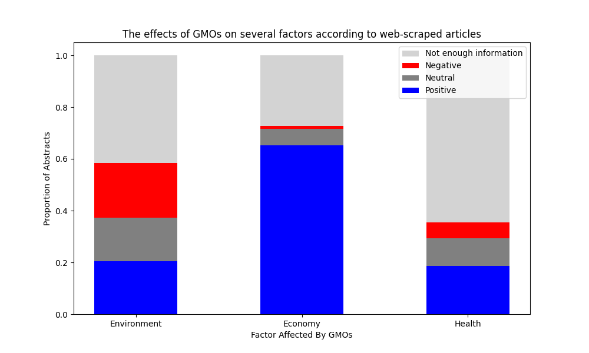

# Scientific Consensus on the Effects of Genetically Modified Organisms

GMOs (genetically modified organisms) are a controversial topic within science, and knowing the scientific consensus of something is crucial to understanding its implications. During my own research with GMOs, both relating to public opinion and general safety, I was curious what the consensus was. 

Therefore, by acquiring abstracts (summaries) of scientific articles pertaining to GMOs, and using AI to determine how GMOs' effects were viewed in each one, I could somewhat accurately determine the scientific viewing relating to this topic.

## Requirements

The requirements to run this project are in the `requirements.txt` file, the contents of which are shown below:

```
g4f==0.0.1.4
bs4==0.0.1
matplotlib==3.7.1
ipykernel==6.23.1
pynterface==0.2.2
js2py==0.74
```

## Method

To acquire the articles, I used [PubMed](https://pubmed.ncbi.nlm.nih.gov), using the search term `"genetically modified organisms effects on the world"`. It was worded this way in order to encapsulate environmental and economic effects as well as health effects. I took all the pages that were available and then found their abstracts using web scraping. The abstracts are stored in the `abstracts.txt` file, where each line represents one abstract.

Then, I used [`gpt4free`](https://github.com/xtekky/gpt4free)'s `Provider.DeepAI` model in order to analyze my texts. The prompt used is here:

```
Analyze the text to determine the effects of genetically modified organisms on the environment,
the economy, and human health. Your output should be in the following format: "environment: 
<response>, economy: <response>, health: <response>",where <response> can be 'G' for good, 'B' 
for bad, 'N' for neutral, or 'I' for not enough information.
```

Then, by using regex to acquire the AI's ratings, I could repeat this process for many abstracts to acquire my data.

## Results

The result after analyzing all 469 articles is below:



The following conclusions can be made about these scientists' opinions:
- The economy is nearly unanimously regarded to be positively or not affected by GMOs
- The environment is both positively and negative affected by GMOs about equally.
- Health is, for the most part, positively or not affected by GMOs, but there are some articles that state the contrary.

## Future Analyses

This program can be easily modified to analyze any other topics' effects on several factors, by simply changing the factors.

## License

This software is released under the MIT License.